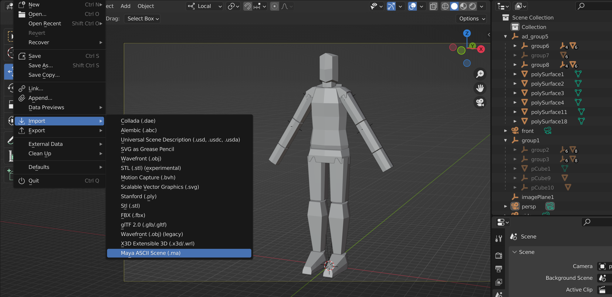

# Open Maya File In Blender

This was mostly written out of curiosity.

<code>"What if you could directly parse an .ma file to import it into Blender"</code>

Over the years I've said many times: <i>"If there exists a file format, someone has written an importer for blender"</i>. 

Figured it was time for me to take a stab at it.

So I found [this repo](https://github.com/mottosso/maya-scenefile-parser), and spent a weekend modifying it and writing an implementation for geometry/uv data for Blender.

It does not deal with construction history or anything like that, so you better hope history has been cleaned in the scene.

<h2>NOTE BEFORE USING</h2>
Would not recommend using this for anything important. Opening the file in Maya and exporting an .fbx will result in 1000x more information being preserved.

<h3>Barely supports:</h3>

- Transforms
- Geometry
- UVs

<h2>How to install</h2>

Grab [a zip file from the releases](https://github.com/rBrenick/open-maya-file-in-blender/releases/download/0.00.01/open_maya_file_in_blender_0-00-01.zip), and install it as an Addon in Blender preferences. 

<h2>Where to find it</h2>

Good luck 🤞
